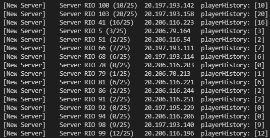

# RIO API

Chamadas da API do Raised in Oblivion implementadas usando node.js.

---

Screenshot do exemplo de server list monitor:



---

## Chamadas implementadas:
  - 🟢 Server List (lista de servidores)
  - 🟡 Get Player Status (status do player como kills e deaths)
  - 🟡 Get Player Characters (personagens do player)

### Legenda:
| |
|-|
| 🟢 = Não precisa de autenticação |
| 🟡 = Precisa de autenticação |

#### Para conseguir informações de player é necessário ter o steamId64 do mesmo.

É possível obter o steamId64 a partir do nickname usando o site [https://www.steamidfinder.com](https://www.steamidfinder.com)

---

## Como instalar:

### Requisitos
- Node.js ([https://nodejs.org/](https://nodejs.org/))

### Clone o repositório
- ``git clone https://github.com/vanflux/rio-api.git``

### Vá até a pasta

- ``cd rio-api``

### Instale as dependências

- ``npm install``

### Rode (A aplicação já vem com 3 exemplos default, des-comente o que você quiser ver)

- ``npm run start`` ou ``npm run dev``

---

## Exemplos com trecho de código:

### Lista de servidores online:

```
let client = new Client();
let response = await client.loadServerList();
if (response.hasError) return console.error(response.data);
console.log(client.serverList.servers);
```

### Informações de um usuário:

```
let client = new Client('STEAM ID 64 AQUI');
let response = await client.loadData();
if (response.hasError) return console.error(response.data);
console.log(client.userData);
```